<!-- ## 👋🏻 I can automate/bot anything 
**As a programmer, it is your job to put yourself out of business. What you do today can be automated tomorrow 🤖 (Doug McIlroy)**

**Never spend 6 minutes doing something by hand when you can spend 6 hours failing to automate it 👷 (Zhuowei Zhang)**

**Automated testing is a safety net that protects the program from its programmers 🐛 (Yegor Bugayenko)**

-->

<!--
## Most Recent Project(s)
| Project         |                                               |
|------------------|-----------------------------------------------------|
| [LinkedIn Follower Bot](https://github.com/Connor9994/LinkedIn-Follower-Bot) |  |
| [Discord Auto Name-Changer](https://github.com/Connor9994/Discord-Name-Bot)| |
| SoundCloud Bot|  |
| Fortnite Leveler| |
| [OSM Fish (/etc) Store Finder](https://github.com/Connor9994/Overpass-API/tree/main)||

## Old Project(s)
| Project         |                                               |
|------------------|-----------------------------------------------------|
| Unreal Engine (2018)   Click for Video -> | |
-->

## 🚀 About Me
Results-driven Lead Software Engineer with over a decade of experience building scalable, customer-focused
applications for organizations all over the globe. Proven expertise in full-stack development, AI-driven
personalization, and end-to-end solution design. Skilled in collaborating on product roadmaps, defining MVPs, and
aligning engineering efforts with business OKRs to deliver impactful, high-quality software. Adept at leading
cross-functional teams, optimizing system performance, and ensuring continuous delivery of robust applications, with
a strong focus on clean code, quality assurance, and seamless user experiences.

## 💻 Skills & Expertise
### Coding Languages:
| Language   |                                                                                                                | Language   |                                                                                                               |
|-------------|--------------------------------------------------------------------------------------------------------------------|--------------|----------------------------------------------------------------------------------------------------------------------|
|Python| | JavaScript|  |Lua| |
|HTML| |CSS|  |AutoHotKey| |  

<!--
### Tools & Technologies:
| Category         | Tools                                               |
|------------------|-----------------------------------------------------|
| Operating Systems| Linux  (Kali  + Fedora  + Qubes )  |
-->

<!--
## 💼 Work Experience
### TANYR Healthcare:
- **Frontend Developer:** Utilized various technologies for efficient data handling and report generation.
- **Information Technology Specialist:** Developed software for workflow automation and ensured data security compliance.

### OSIsoft:
- **Product Support Engineer:** Provided technical support, developed automated utilities, and conducted field-service trips for troubleshooting.
-->

<!--
## 🌟 Fun Projects:
<table style="width: 100%;">
  <tr>
    <td>Spotify Auto-Viewer Spotify Account-Creator</td>
    <td></td>
  </tr>
  <tr>
    <td>WoW fishing bot (Normal/Classic)</td>
    <td></td>
  </tr>
  <tr>
    <td>Bitcoin trading bot </td>
    <td></td>
  </tr>
  <tr>
    <td>Healthcare applications (HIPAA compliant)</td>
    <td></td>
  </tr>
  <tr>
    <td>Salesforce add-ons  </td>
    <td></td>
  </tr>
  <tr>
    <td>Social media bots </td>
    <td></td>
  </tr>
  <tr>
    <td>SPY trading-strategy generators </td>
    <td></td>
  </tr>
</table>
-->

## 📫 Let's Connect!
Feel free to reach out for collaboration opportunities, technical discussion, or just to say hi! 

### Want to Send Me An Email?
You can reach me at [abdullahshiwani@gmail.com](mailto:abdullahshiwani@gmail.com) for any queries.

## 🚀 Decision Flow: From Problem Discovery to Outcome

```mermaid
flowchart LR
    direction LR
    subgraph 1[" "]
        direction TB
        top1[Find Abdullah's Profile] --> bottom1[Hire Abdullah 🤝]
    end
    subgraph 2[" "]
        direction TB
        top2[Google Endlessly 🔎] --> bottom2[Waste Time ⌛]
    end

    %% Link to subgraph1
    3[Discover Problem 🐛] --> 1

    %% Link within subgraph2
    3[Discover Problem 🐛] --> 2

    1 --> outside1["Profit" 📈]
    2 --> outside2["Miss Opportunity" 🚫]

    click top1 "https://www.linkedin.com/in/abdullahshiwani/" "LinkedIn"

    style 1 stroke:#072ff7,stroke-width:5px
    style 2 stroke:#f70707,stroke-width:5px
```

